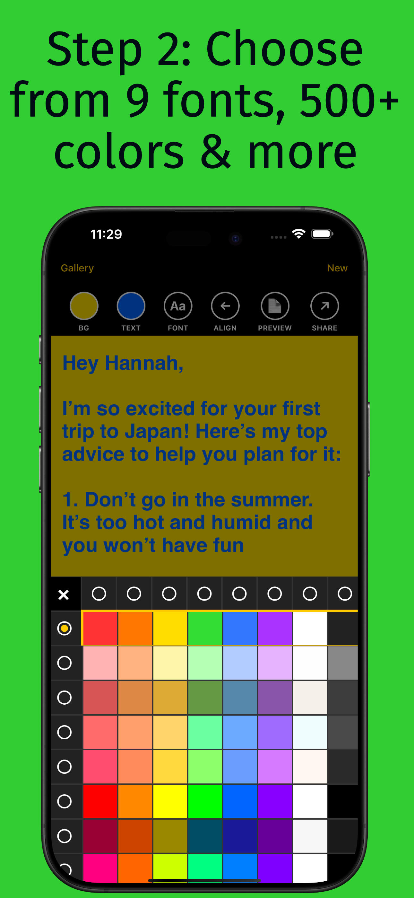
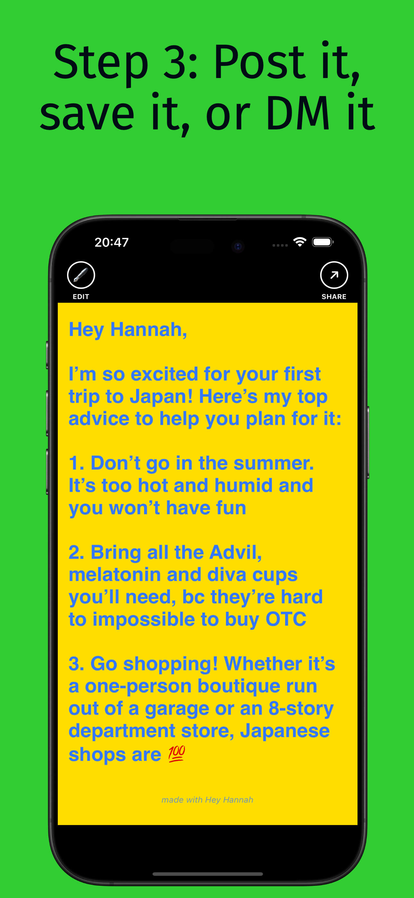

# Hey Hannah

  

An open source [iPhone app](https://apps.apple.com/us/app/hey-hannah/id6751516377) for creating text images.

## Overview

Hey Hannah converts text into JPG images for sharing. Users create text-based images for social media, messaging, or to save as photos.

## Features

- **Text Creation & Editing**: Type and edit text
- **Image Export**: Save text as JPG images
- **Sharing**: Copy images to clipboard or share to other apps
- **Formatting Options**: Choose from 8 colors, 3 fonts & 3 alignments

## Distribution

[Hey Hannah](https://apps.apple.com/us/app/hey-hannah/id6751516377) is a **free app** on the [Apple App Store](https://apps.apple.com/us/app/hey-hannah/id6751516377).

Visit our [project website](https://decentralizeddan.github.io/hey-hannah) for more information.

## Open Source

This project is open source and accepts contributions. Contact heyhannah.app AT proton.me to contribute.

## Privacy

See our [Privacy Policy](privacy.md) for details on data handling and user privacy.

## License

This project is licensed under the [GPL-3.0 License](https://www.gnu.org/licenses/gpl-3.0.en.html#license-text).
